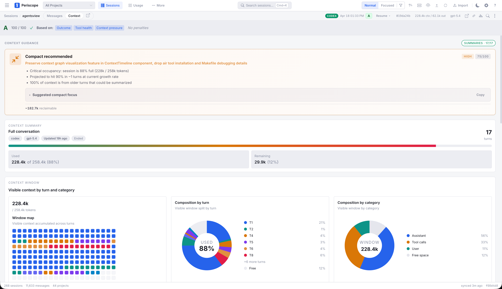

# Periscope

Context session visualizer and improver for AI coding agents.

Browse, search, and track costs across all your AI coding agents. See where
your context window is going, understand session health, and get guidance on
when to continue, rewind, compact, or start fresh. One binary, no accounts,
everything local.

<p align="center">
  
</p>

## Install

```bash
# macOS / Linux
curl -fsSL https://agentsview.io/install.sh | bash

# Windows
powershell -ExecutionPolicy ByPass -c "irm https://agentsview.io/install.ps1 | iex"
```

Or download the **desktop app** (macOS / Windows) from
[GitHub Releases](https://github.com/wesm/agentsview/releases).

## Quick Start

```bash
agentsview                 # start server, open web UI
agentsview usage daily     # print daily cost summary
go run ./cmd/agentsview sync --full
```

On first run, agentsview discovers sessions from every supported agent on your
machine, syncs them into a local SQLite database, and opens a web UI at
`http://127.0.0.1:8080`.

## Token Usage and Cost Tracking

`agentsview usage` is a fast, local replacement for ccusage and similar tools.
It tracks token consumption and compute costs across **all** your coding agents
-- not just Claude Code. Because session data is already indexed in SQLite,
queries are over 100x faster than tools that re-parse raw session files on every
run.

```bash
# Daily cost summary (default: last 30 days)
agentsview usage daily

# Per-model breakdown
agentsview usage daily --breakdown

# Filter by agent and date range
agentsview usage daily --agent claude --since 2026-04-01

# One-line summary for shell prompts / status bars
agentsview usage daily --all --json
agentsview usage statusline
```

Features:

- Automatic pricing via LiteLLM rates (with offline fallback)
- Prompt-caching-aware cost calculation (cache creation / read tokens)
- Per-model breakdown with `--breakdown`
- Date filtering (`--since`, `--until`, `--all`), agent filtering (`--agent`)
- JSON output (`--json`) for scripting
- Timezone-aware date bucketing (`--timezone`)
- Works standalone -- no server required, just run the command

## Session Browser

| Dashboard                                                     | Session viewer                                                          |
| ------------------------------------------------------------- | ----------------------------------------------------------------------- |
|  |  |

| Search                                                          | Activity heatmap                                          |
| --------------------------------------------------------------- | --------------------------------------------------------- |
|  |  |

- **Full-text search** across all message content (FTS5)
- **Token usage and cost dashboard** -- per-session and per-model cost
  breakdowns, daily spend charts, all in the web UI
- **Analytics dashboard** -- activity heatmaps, tool usage, velocity metrics,
  project breakdowns
- **Live updates** via SSE as active sessions receive new messages
- **Keyboard-first** navigation (`j`/`k`/`[`/`]`, `Cmd+K` search, `?` for all
  shortcuts)
- **Export** sessions as HTML or publish to GitHub Gist

## Context Engineering

Periscope adds a context visualizer and guidance layer on top of the session
browser. It answers questions that raw transcripts cannot:

- Where did the context budget go?
- Which tool outputs are now dead weight?
- Is the session still healthy enough to continue?
- Would a rewind, compaction, or fresh session be the better move?

It provides a turn-by-turn timeline view with composition breakdowns and token
accounting, plus a guidance layer that classifies session health, detects
branch points, and recommends concrete next actions — continue, rewind,
compact, fork, or delegate. See the full
[Periscope spec](docs/periscope-spec.md) for detailed design, data model,
and implementation notes.

## Supported Agents

agentsview auto-discovers sessions from all of these:

| Agent          | Session Directory                                  |
| -------------- | -------------------------------------------------- |
| Claude Code    | `~/.claude/projects/`                              |
| Codex          | `~/.codex/sessions/`                               |
| Copilot CLI    | `~/.copilot/`                                      |
| Gemini CLI     | `~/.gemini/`                                       |
| OpenCode       | `~/.local/share/opencode/`                         |
| OpenHands CLI  | `~/.openhands/conversations/`                      |
| Cursor         | `~/.cursor/projects/`                              |
| Amp            | `~/.local/share/amp/threads/`                      |
| iFlow          | `~/.iflow/projects/`                               |
| VSCode Copilot | `~/Library/Application Support/Code/User/` (macOS) |
| Pi             | `~/.pi/agent/sessions/`                            |
| OpenClaw       | `~/.openclaw/agents/`                              |
| Kimi           | `~/.kimi/sessions/`                                |
| Kiro CLI       | `~/.kiro/sessions/cli/`                            |
| Kiro IDE       | `~/Library/Application Support/Kiro/` (macOS)      |
| Cortex Code    | `~/.snowflake/cortex/conversations/`               |

Each directory can be overridden with an environment variable. See the
[configuration docs](https://agentsview.io/configuration/) for details.

## PostgreSQL Sync

Push session data to a shared PostgreSQL instance for team dashboards:

```bash
agentsview pg push       # push local data to PG
agentsview pg serve      # serve web UI from PG (read-only)
```

See [PostgreSQL docs](https://agentsview.io/postgresql/) for setup and
configuration.

## Privacy

No telemetry, no analytics, no accounts. All data stays on your machine. The
server binds to `127.0.0.1` by default. The only outbound request is an optional
update check on startup (disable with `--no-update-check`).

## Documentation

Full docs at **[agentsview.io](https://agentsview.io)**:
[Quick Start](https://agentsview.io/quickstart/) --
[Usage Guide](https://agentsview.io/usage/) --
[CLI Reference](https://agentsview.io/commands/) --
[Configuration](https://agentsview.io/configuration/) --
[Architecture](https://agentsview.io/architecture/)

______________________________________________________________________

## Development

Requires Go 1.25+ (CGO), Node.js 22+.

```bash
make dev            # Go server (dev mode)
make frontend-dev   # Vite dev server (run alongside make dev)
make build          # build binary with embedded frontend
make install        # install to ~/.local/bin
```

If `make dev` auto-selects a port other than `8080`, point the Vite proxy at
that backend before starting the frontend dev server:

```bash
AGENTSVIEW_DEV_PROXY_TARGET=http://127.0.0.1:8081 make frontend-dev
```

```bash
make test           # Go tests (CGO_ENABLED=1 -tags fts5)
make lint           # golangci-lint
make e2e            # Playwright E2E tests
```

Pre-commit hooks via [prek](https://github.com/j178/prek): `make install-hooks`
after cloning (requires `prek` and `uv`).

### JetBrains Plugin

The `jetbrains-plugin/` directory contains a JetBrains IDE plugin that embeds
the agentsview web UI in a tool window. Requires JDK 17+.

```bash
cd jetbrains-plugin
./gradlew build       # compile and package the plugin
./gradlew runIde      # launch a sandboxed IDE with the plugin loaded
./gradlew buildPlugin # produce distributable ZIP in build/distributions/
```

### Project Layout

```
cmd/agentsview/     CLI entrypoint
internal/           Go packages (config, db, parser, server, sync, postgres)
frontend/           Svelte 5 SPA (Vite, TypeScript)
desktop/            Tauri desktop wrapper
jetbrains-plugin/   JetBrains IDE plugin (Kotlin, Gradle)
```

## Acknowledgements

Forked from [agentsview](https://github.com/wesm/agentsview) by Wes McKinney.

Also inspired by
[claude-history-tool](https://github.com/andyfischer/ai-coding-tools/tree/main/claude-history-tool)
by Andy Fischer and
[claude-code-transcripts](https://github.com/simonw/claude-code-transcripts) by
Simon Willison.

## License

MIT
